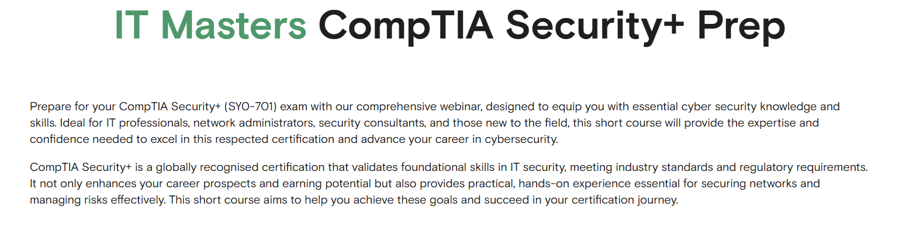
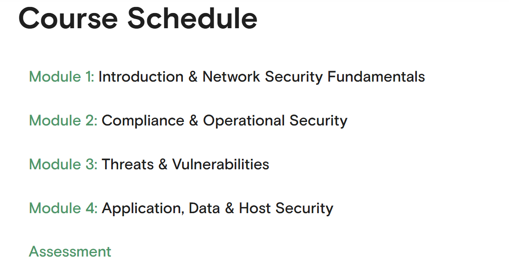

# 🛡 CompTIA Security+ (SY0-601) Prep – IT Masters

This repository contains my study notes, practice exercises, checklists, and the completion certificate for the **CompTIA Security+ (SY0-601) Preparation** course by [IT Masters](https://www.itmasters.edu.au/free-short-course/comptia-security-prep/).

---

## 📚 Study Notes

- 📂 [`security-fundamentals.md`](./notes/security-fundamentals.md) – Core security principles  
- 📂 [`risk-management.md`](./notes/risk-management.md) – Risk analysis and mitigation  
- 📂 [`network-security.md`](./notes/network-security.md) – Secure network design and controls  
- 📂 [`threats-attacks.md`](./notes/threats-attacks.md) – Threat actors and common attack types  

---

## 🧪 Practice & Demos

- 📒 [`practice-questions.md`](./demo/practice-questions.md) – Sample multiple-choice questions with explanations  
- 📒 [`scenario-exercises.md`](./demo/scenario-exercises.md) – Real-world security scenarios for analysis  

---

## 📋 Checklists

- 📑 [`security-checklist.md`](./checklists/security-checklist.md) – General security best practices  
- 📑 [`network-security-checklist.md`](./checklists/network-security-checklist.md) – Network security hardening  
- 📑 [`incident-response-checklist.md`](./checklists/incident-response-checklist.md) – Step-by-step IR handling  

---

## 📸 Screenshots

| Lesson / Content          | Screenshot |
|---------------------------|------------|
| 📘 Course Introduction    |  |
| 🗓 Course Schedule        |  |

---

## 📜 Certificate

🧠 [CompTIA Security+ Prep – IT Masters](./cert/CompTIA%20Security%2B%20Prep.pdf)

---

## 📝 Course Review

The **CompTIA Security+ Prep** course by IT Masters provides a well-structured foundation for those preparing for the **SY0-601** exam.

✅ **What I Liked**  
- Structured syllabus aligned with Security+ exam domains  
- Real-world examples and clear explanations  
- Balanced mix of theory and practice  

📌 **What Could Be Improved**  
- More lab-based activities for hands-on learning  
- Additional scenario-based practice questions  

---

## 🎓 Final Thoughts

This course is ideal for:
- Learners preparing for **CompTIA Security+**
- IT professionals transitioning into **cybersecurity**
- Students seeking a comprehensive, self-paced Security+ overview

💡 Recommended for: Security+ candidates and anyone looking to strengthen foundational security knowledge.

---

## 📌 Notes

- All content here is my personal study material based on the course.  
- Course provider: [IT Masters](https://www.itmasters.edu.au/)  
- Aligned with **CompTIA Security+ SY0-601** domains.  

---

## ✍️ Author

**Thành Danh** – Pentester & Cybersecurity Researcher  

GitHub: [@ngvtdanhh](https://github.com/ngvtdanhh)  

Email: ngvu.thdanh@gmail.com  

---

## 📄 License

This project is licensed under the terms of the **MIT License**.  
See [`LICENSE`](./LICENSE) for full details.

© 2025 ngvtdanhh. All rights reserved.
